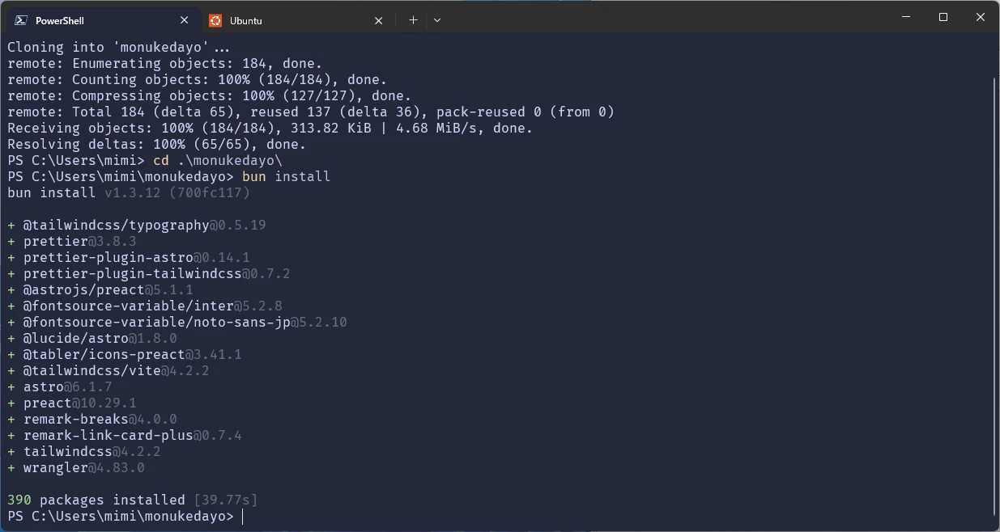
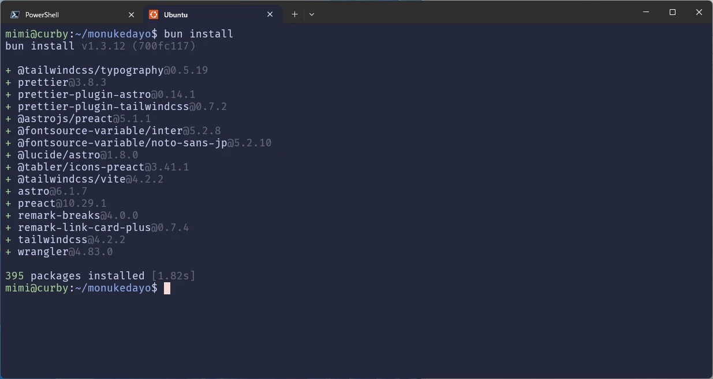

## Windowsは遅い

最初から比較です。  
このブログのリポジトリをクローンして、依存関係をインストールする時間の比較。

### Windows



約40秒です。

### WSL2(Ubuntu)



約2秒です。

## ストレスである

Windowsで開発していました。前までは。  
いやしかし、パッケージのインストールが遅すぎる。

MacBookで開発しているとパッケージのインストールとか開発サーバーの起動が速いのなんの。

Macで開発したあとにWindowsに戻るともう遅くてストレスでした。

## WSLをインストールしよう

WSL2をインストールしていこう。

```shell
wsl --install -d ubuntu
```

でインストールできます。場合によっては再起動が必要になるかもしれません。

## おわり

内容が薄いですが、以上です。
NTFSの仕様上小さいファイルの操作が遅いらしい。フォーマットを選べるようになって欲しいな。